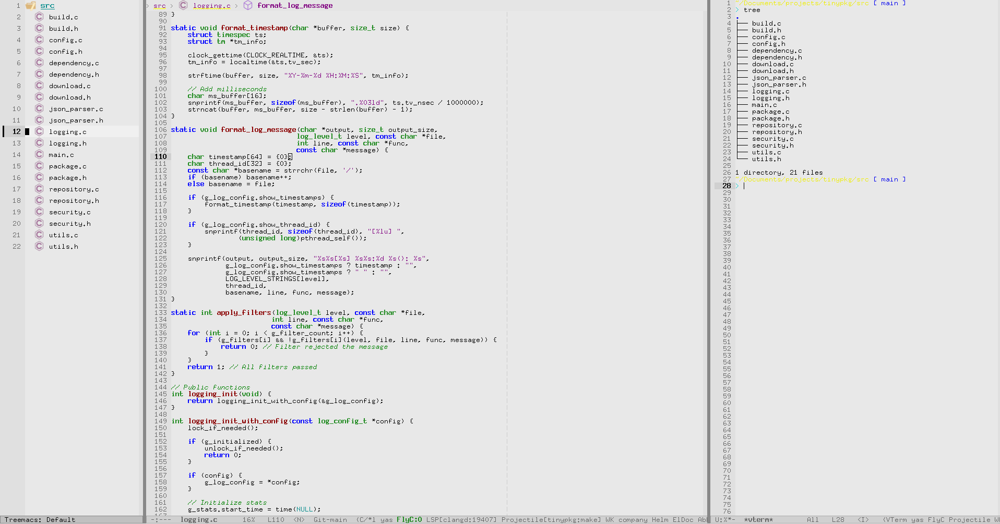

# Legacy Emacs Configuration

[](https://opensource.org/licenses/MIT)
[](https://www.gnu.org/software/emacs/)
[](https://www.linux.org/)

> A vintage, lightweight Emacs configuration that brings back the classic terminal aesthetic with modern IDE features.



## Features

- **Classic Light Theme** - Authentic vintage terminal look with light gray background
- **Vim Keybindings** - Full Evil mode integration for Vim users
- **Enhanced Search** - Improved find functionality with Helm/Swiper
- **Smart Autocompletion** - Intelligent code completion with Company mode
- **Language Support** - Built-in LSP support for C/C++ and Java
- **Bitmap Fonts** - Classic monospace fonts (6x13, fixed) with modern fallbacks
- **Terminal Integration** - VTerm for seamless terminal experience
- **Line Numbers** - Classic gutter line numbers like old editors
- **Lightweight** - Minimal resource usage, maximum performance

## Screenshot

The configuration recreates the authentic vintage computing experience while providing modern development tools.

## Installation

### Quick Install

```bash
# Clone the repository
git clone https://github.com/user7210unix/emacs-legacy.git
cd emacs-legacy

# Backup your existing config (if any)
mv ~/.emacs.d ~/.emacs.d.backup 2>/dev/null || true

# Install configuration
mkdir -p ~/.emacs.d
cp init.el ~/.emacs.d/

# Start Emacs (packages will auto-install)
emacs
```

### Manual Setup

1. Download `init.el` from this repository
2. Place it in `~/.emacs.d/init.el`
3. Start Emacs - packages will automatically install on first run

## Distribution-Specific Dependencies

### Gentoo Linux

```bash
# Essential packages
sudo emerge -av media-fonts/font-misc-misc \
              media-fonts/font-adobe-75dpi \
              media-fonts/font-adobe-100dpi \
              sys-libs/ncurses \
              dev-util/ccls \
              dev-java/openjdk \
              dev-vcs/git \
              sys-devel/gcc \
              sys-devel/gdb

# Rebuild font cache
sudo fc-cache -fv

# Optional: Enable bitmap fonts in X11
echo 'FontPath "/usr/share/fonts/misc/"' | sudo tee -a /etc/X11/xorg.conf.d/fonts.conf
```

**Emacs USE flags** (add to `/etc/portage/package.use/emacs`):
```
app-editors/emacs gtk gtk3 xft truetype imagemagick json
```

### Debian/Ubuntu

```bash
# Essential packages
sudo apt update
sudo apt install -y emacs \
                   xfonts-base \
                   xfonts-75dpi \
                   xfonts-100dpi \
                   fonts-terminus-otb \
                   build-essential \
                   clang \
                   ccls \
                   openjdk-11-jdk \
                   git \
                   gdb \
                   libncurses-dev

# Rebuild font cache
sudo fc-cache -fv
```

### Void Linux

```bash
# Essential packages
sudo xbps-install -S emacs \
                    font-misc-misc \
                    font-adobe-75dpi \
                    font-adobe-100dpi \
                    terminus-font \
                    clang \
                    ccls \
                    openjdk11 \
                    git \
                    gdb \
                    ncurses-devel

# Rebuild font cache
sudo fc-cache -fv
```

### Arch Linux

```bash
# Essential packages
sudo pacman -S emacs \
              xorg-fonts-misc \
              xorg-fonts-75dpi \
              xorg-fonts-100dpi \
              terminus-font \
              clang \
              ccls \
              jdk-openjdk \
              git \
              gdb \
              ncurses

# AUR packages (optional)
yay -S eclipse-jdt-ls

# Rebuild font cache
sudo fc-cache -fv
```

## Font Configuration

### Primary Fonts (Vintage Look)
- `fixed` - Classic X11 bitmap font
- `6x13` - Popular terminal font
- Various X11 bitmap font specifications

### Fallback Fonts
- `Terminus` - Modern bitmap-style font
- `Monaco` - macOS-style monospace
- `Consolas` - Windows-style monospace
- System monospace as final fallback

### Font Installation Verification

Test if vintage fonts are available:
```bash
# List available fixed-width fonts
fc-list :spacing=mono | grep -i fixed

# Test specific fonts
fc-list | grep -E "(fixed|terminus|6x13)"
```

## Key Bindings

### Essential Shortcuts
| Key Combination | Function |
|----------------|----------|
| `C-s` | Enhanced search (Swiper/Isearch) |
| `C-x C-f` | Find files (Helm/built-in) |
| `C-x b` | Switch buffers |
| `C-c h` | Helm command prefix |
| `C-c t` | Open terminal (VTerm) |
| `C-c p` | Projectile commands |
| `C-c r` | Query replace |
| `C-c g` | Go to line |

### Vim Bindings (Evil Mode)
All standard Vim navigation and editing commands work:
- `hjkl` - Movement
- `i`, `a`, `o` - Insert modes  
- `d`, `y`, `p` - Delete, yank, paste
- `v`, `V`, `Ctrl-v` - Visual modes
- `:w`, `:q`, `:wq` - File operations

## Language Support

### C/C++ Development
- **LSP Server**: CCLS for intelligent code completion
- **Syntax Checking**: Flycheck integration
- **Debugging**: GDB integration
- **Code Formatting**: Built-in C style configuration

### Java Development  
- **LSP Server**: Eclipse JDT Language Server
- **Project Management**: Maven/Gradle support via LSP
- **Syntax Checking**: Flycheck with Java checkers
- **Code Snippets**: YASnippet templates

### Adding New Languages

To add support for additional languages:

1. Install the appropriate LSP server for your language
2. Add LSP hook to your mode:
   ```elisp
   (add-hook 'your-mode-hook #'lsp)
   ```
3. Configure language-specific settings as needed

## Configuration Structure

```
~/.emacs.d/
├── init.el              # Main configuration file
├── elpa/               # Auto-installed packages
├── auto-save-list/     # Auto-save information
└── eshell/            # Shell history (if using eshell)
```

## Customization

### Changing the Color Scheme

The configuration uses a light theme by default. To modify colors, edit the `custom-set-faces` section in `init.el`:

```elisp
;; Example: Make background pure white
'(default ((t (:background "#ffffff" :foreground "#000000"))))
```

### Adding Custom Packages

Add packages to the `required-packages` list:

```elisp
(defvar required-packages
  '(evil
    helm
    your-package-here  ; Add your package
    ;; ... other packages
    ))
```

### Font Customization

Modify the font priority list in the `set-vintage-font` function:

```elisp
(let ((fonts '("your-preferred-font"
               "fixed"
               "6x13"
               ;; ... other fonts
               )))
```

## Troubleshooting

### Common Issues

**Package Installation Fails**
```bash
# In Emacs:
M-x package-refresh-contents
M-x package-install RET package-name
```

**Fonts Not Loading**
```bash
# Verify font installation
fc-list | grep fixed
# Rebuild font cache
sudo fc-cache -fv
# Restart X11/Wayland session
```

**LSP Server Not Working**
- Ensure language servers are installed system-wide
- Check if the project has a proper build file (Makefile, pom.xml, etc.)
- Restart LSP: `M-x lsp-restart-workspace`

**VTerm Compilation Issues**
```bash
# Install cmake and libtool
sudo apt install cmake libtool-bin  # Debian/Ubuntu
sudo emerge cmake libtool          # Gentoo
```

### Debug Mode

Enable debug mode for troubleshooting:
```bash
emacs --debug-init
```

## License

This project is licensed under the MIT License - see the [LICENSE](LICENSE) file for details.

## Acknowledgments

- **GNU Emacs** - The extensible, customizable text editor
- **Evil Mode** - Vim emulation for Emacs
- **Helm** - Incremental completion framework
- **Company Mode** - Modular text completion framework
- **LSP Mode** - Language Server Protocol support
- The classic computing community for inspiration

## Additional Resources

- [GNU Emacs Manual](https://www.gnu.org/software/emacs/manual/)
- [Evil Mode Documentation](https://evil.readthedocs.io/)
- [LSP Mode Documentation](https://emacs-lsp.github.io/lsp-mode/)
- [Emacs Stack Exchange](https://emacs.stackexchange.com/)

---

**A timeless text editor configuration**
