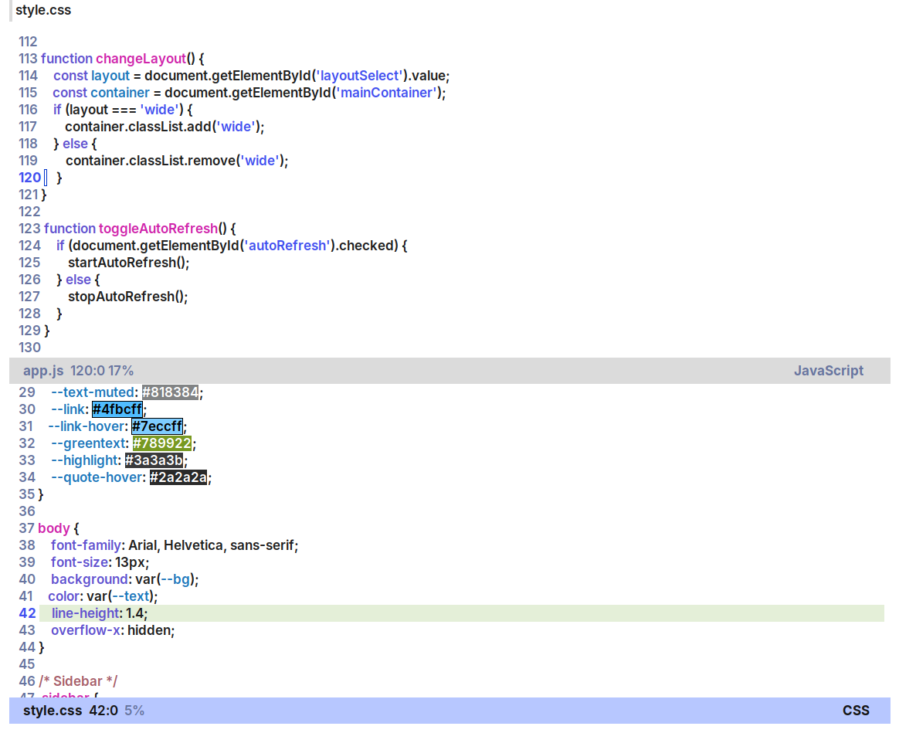

<div align="center">

# GNOME Emacs

</div>

<table>
<tr>
<td width="50%">

A minimal, modern Emacs configuration styled to look and feel like a native GNOME application.


</td>
<td width="50%">



</td>
</tr>
</table>

## Philosophy

This configuration transforms Emacs into a clean, distraction-free editor that seamlessly integrates with the GNOME desktop environment. It emphasizes:

- **Visual consistency** with GNOME's design language
- **Minimalism** without sacrificing functionality
- **Performance** through careful package selection
- **Modern defaults** that feel familiar to GNOME users

## Features

### Visual Design
- **Light theme** using `ef-themes` for optimal readability
- **Custom spacing** with `spacious-padding` for a spacious, modern layout
- **Inter SemiBold** font for crisp, professional typography
- **Tab bar** styled like GNOME's tabbed interfaces
- **Minimal modeline** using `mood-line` for a clean footer
- **Nerd Icons** throughout for visual consistency

### Developer Experience
- **LSP integration** with full Java support (easily extensible)
- **Vertico + Orderless** for fast, fuzzy completion
- **Flycheck** for on-the-fly syntax checking
- **Company** for intelligent code completion
- **Line numbers** in programming modes
- **Smooth scrolling** with pixel precision

## Screenshots

*Add screenshots of your setup here showing the clean interface, completion, and LSP features*

## Prerequisites

- **Emacs 26.0.50 or later** (for native line numbers)
- **Inter font family** - Install from [rsms.me/inter](https://rsms.me/inter/)
- **Java Development Kit** (if using Java features)
- **Nerd Fonts** - For icon support

### Installing Inter Font (Debian/Ubuntu)

```bash
# Download and install Inter
mkdir -p ~/.local/share/fonts
cd ~/.local/share/fonts
wget https://github.com/rsms/inter/releases/download/v4.0/Inter-4.0.zip
unzip Inter-4.0.zip
fc-cache -fv
```

## Installation

### Quick Start

```bash
# Backup your existing configuration
mv ~/.emacs.d ~/.emacs.d.backup
mv ~/.emacs ~/.emacs.backup 2>/dev/null

# Clone this configuration
git clone https://github.com/yourusername/gnome-emacs.git ~/.emacs.d

# Start Emacs
emacs
```

On first launch, Emacs will automatically download and install all required packages. This may take a few minutes.

### Manual Installation

1. Copy `init.el` to `~/.emacs.d/init.el`
2. Launch Emacs
3. Wait for packages to install automatically

## Configuration

### Java Development Setup

The configuration includes LSP settings for Java development. Update the codestyle path in `init.el`:

```elisp
(setq lsp-java-format-settings-url
      "file:///path/to/your/codestyle.xml")
```

### Font Customization

To adjust font size or family, modify the `custom-set-faces` section:

```elisp
'(default ((t (:family "Inter" :weight semi-bold :height 128))))
```

Font height is in 1/10pt (128 = 12.8pt).

### Adding More Languages

Extend LSP support by adding language hooks:

```elisp
(use-package lsp-mode
  :hook ((python-mode . lsp)
         (rust-mode . lsp)
         (go-mode . lsp)))
```

### Adjusting Padding

Customize the spacious-padding widths:

```elisp
(setq spacious-padding-widths
      '( :internal-border-width 15
         :mode-line-width 6
         :right-divider-width 10
         :scroll-bar-width 8))
```

## Package Overview

| Package | Purpose |
|---------|---------|
| `ef-themes` | Beautiful, accessible light theme |
| `spacious-padding` | Generous whitespace for modern look |
| `vertico` | Vertical completion interface |
| `marginalia` | Rich annotations in completion |
| `orderless` | Flexible completion matching |
| `company` | Text completion framework |
| `lsp-mode` | Language Server Protocol client |
| `lsp-java` | Java language server integration |
| `flycheck` | On-the-fly syntax checking |
| `mood-line` | Minimal, informative modeline |
| `nerd-icons` | Icon support throughout Emacs |

## Keybindings

This configuration uses standard Emacs keybindings with LSP additions:

- `C-c l` - LSP command prefix
- `M-x` - Command execution (with Vertico completion)
- `C-x b` - Switch buffer (with icons and annotations)
- `C-x C-f` - Find file (with fuzzy matching)

## Performance Tips

- The configuration disables file watchers for LSP to improve performance
- Java LSP is configured with optimized JVM arguments
- Consider adding more directories to `.gitignore` for faster project scanning

## Troubleshooting

### Icons not displaying
```bash
M-x nerd-icons-install-fonts
```

### LSP server not starting
Ensure you have the language server installed. For Java:
```bash
# LSP will download jdtls automatically on first use
```

### Theme not loading
Ensure `ef-themes` is installed:
```elisp
M-x package-install RET ef-themes RET
```

## Customization

This configuration is designed to be a starting point. Common customizations:

- **Dark theme**: Replace `ef-light` with `ef-dark` or `ef-deuteranopia-dark`
- **Different font**: Change the `:family` in `custom-set-faces`
- **Disable line numbers**: Remove the `global-display-line-numbers-mode` section
- **Add keybindings**: Use `global-set-key` or package-specific `:bind` declarations

## Contributing

Contributions are welcome! Please feel free to submit issues or pull requests.

## License

This configuration is released under the MIT License. See LICENSE file for details.

## Acknowledgments

- The Emacs community for creating amazing packages
- GNOME design team for inspiration
- [Protesilaos Stavrou](https://protesilaos.com/) for ef-themes and spacious-padding

---

**Made with ❤️ for the GNOME desktop**
